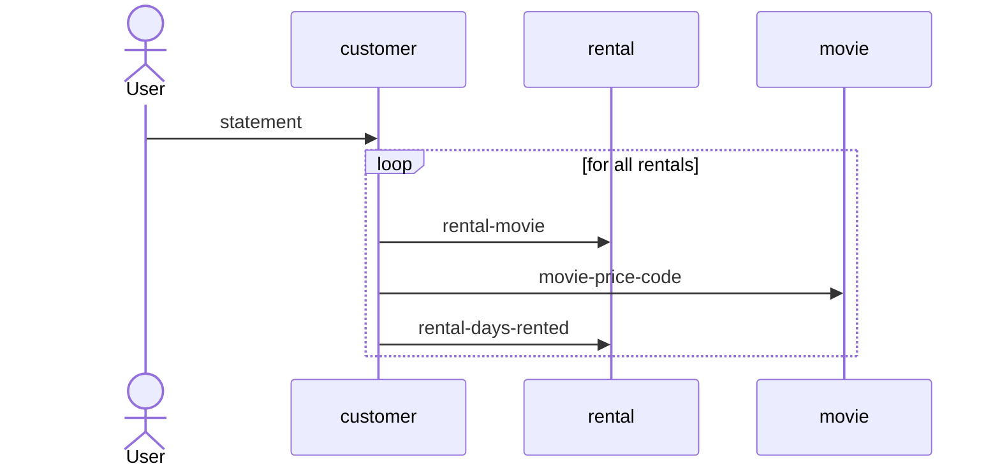
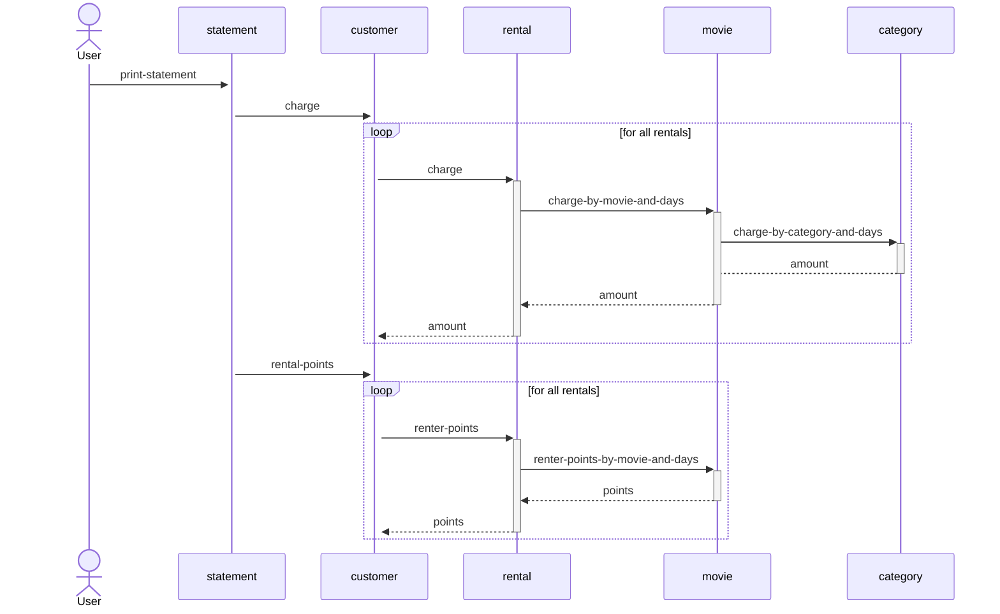

# dylan-video-club
Example from 'Refactoring' book of Martin Fowler.

## Video-club example

I re-do the first example in Martin Fowler's book 
"Refactoring: Improving the design of existing code" 
edition 1, in [Opendylan][opendylan].

## Start diagram

The initial interaction for the method `statement` 
is shown in the next figure:

## Finish diagram

The translation between a multi-method Object Oriented
programming and the sequence diagram is not 1 to 1.
For instance `category` is not a class but a symbol.

[opendylan]: https://opendylan.org